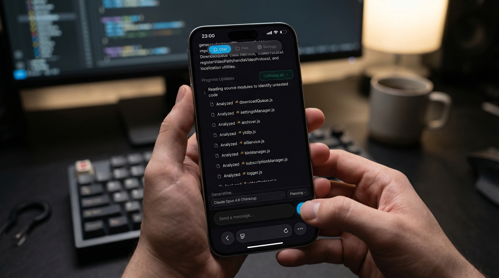

# Antigravity Mobile

Mobile dashboard and admin panel for [Antigravity IDE](https://antigravity.google). Monitor conversations, manage your agent, and get notified — all from your phone.

<p align="center">
  
</p>

## Features

**Mobile Dashboard** — Real-time chat streaming, file browser with syntax highlighting, model quota monitor, and quick commands. Available in full and lite mode for low-bandwidth use.

**Admin Panel** (`/admin`) — Localhost-only control panel with:
- Telegram bot notifications (completion, input needed, errors)
- Auto-accept for command prompts (Run, Allow, Continue, etc.)
- Quick commands — saved prompts injected directly into the agent
- Screenshot timeline with auto-capture
- Theme and layout customization for the mobile dashboard
- Multi-device CDP switching
- Remote access via Cloudflare quick tunnels
- Session event logs

**Remote Access** — Secure access from anywhere using Cloudflare quick tunnels. No account required — generates a random `.trycloudflare.com` URL with QR code. Auto-start option available.

**Error Detection** — Monitors both the chat stream and full-page modal dialogs for errors like "Agent terminated" and "Model quota reached". Sends Telegram alerts on detection.

**Security** — Optional PIN authentication with IP-based rate limiting (5 attempts, 15-min lockout), localhost-only admin endpoints, encrypted tunnels via Cloudflare HTTPS. No data sent externally (Telegram API excluded).

## Quick Start

**Requirements:** Node.js 18+, Antigravity IDE installed. Optional: [`cloudflared`](https://developers.cloudflare.com/cloudflare-one/connections/connect-networks/downloads/) for remote access (the launch script offers to install it automatically).

```bash
git clone https://github.com/AvenalJ/AntigravityMobile.git
cd AntigravityMobile
```

**Windows:** Double-click `Start-Antigravity-Mobile.bat`
**macOS/Linux:** `./Start-Antigravity-Mobile.sh`

The admin panel opens automatically at `http://localhost:3001/admin`.
Access the mobile dashboard from your phone at `http://YOUR_PC_IP:3001`.

Dependencies install automatically on first run. The script handles launching Antigravity with CDP enabled.

To stop: run `Stop-Antigravity-Mobile.bat` (Windows) or `./Stop-Antigravity-Mobile.sh`.

## Architecture

```
┌──────────────────────────────────────────────────────────┐
│  Your Machine                                             │
│                                                           │
│  Antigravity IDE ◄──── CDP ────► Antigravity Mobile       │
│                                  Server (:3001)           │
│                                    │           │          │
│                              WebSocket       HTTPS        │
│                                    │           │          │
│                               Phone 📱    Telegram 🤖    │
└──────────────────────────────────────────────────────────┘
```

| Component | Description |
|-----------|-------------|
| `src/http-server.mjs` | Express server, API endpoints, WebSocket bridge |
| `src/chat-stream.mjs` | CDP-based chat capture, auto-accept, notification triggers |
| `src/cdp-client.mjs` | Chrome DevTools Protocol client (screenshots, input injection, DOM queries) |
| `src/supervisor-service.mjs` | AI supervisor — autonomous monitoring, error recovery, task queue, assist chat |
| `src/ollama-client.mjs` | Thin wrapper around the Ollama REST API |
| `src/telegram-bot.mjs` | Telegram Bot API — sends alerts for agent events |
| `src/tunnel.mjs` | Cloudflare quick tunnel management (start/stop/status) |
| `src/config.mjs` | Persistent JSON config store |
| `src/quota-service.mjs` | Language server quota polling (Windows only) |
| `src/launcher.mjs` | Orchestrates startup: server, CDP, Antigravity launch |

## Configuration

### Port

Default is `3001`. Change in `launcher.mjs`:
```javascript
const HTTP_PORT = 3001;
```

### PIN Authentication

The start script prompts for an optional 4–6 digit PIN. You can also set it via environment variable:

```bash
MOBILE_PIN=1234 node http-server.mjs
```

The admin panel shows whether authentication is currently active. To disable, click **Clear PIN** in Server settings.

### Remote Access

1. Install `cloudflared` (the launch script offers to do this automatically)
2. Go to Admin Panel → Remote Access
3. Click **Start Tunnel** — a random public URL and QR code appear
4. PIN authentication is required before the tunnel can be started
5. Enable **Auto-start** to launch the tunnel on every server boot

### Telegram Bot

1. Create a bot via [@BotFather](https://t.me/BotFather)
2. Get your chat ID from [@userinfobot](https://t.me/userinfobot)
3. Enter both in Admin Panel → Telegram tab → Save & Connect
4. Toggle notification types individually

### CDP

The start script launches Antigravity with `--remote-debugging-port=9222` automatically. If running Antigravity manually:

```bash
antigravity --remote-debugging-port=9222
```

## Project Structure

```
├── public/
│   ├── index.html              # Mobile dashboard
│   ├── minimal.html            # Lite mode (chat only)
│   ├── admin.html              # Admin panel
│   ├── manifest.json           # PWA manifest
│   ├── sw.js                   # Service worker
│   ├── css/
│   │   ├── variables.css       # CSS custom properties & theme variables
│   │   ├── layout.css          # Page layout, topbar, panels
│   │   ├── components.css      # Buttons, cards, forms, modals
│   │   ├── themes.css          # Theme overrides (dark, light, pastel, rainbow, slate)
│   │   ├── chat.css            # Chat message styling
│   │   ├── files.css           # File browser styling
│   │   ├── settings.css        # Settings panel styling
│   │   └── assist.css          # Supervisor assist tab styling
│   └── js/
│       ├── app.js              # App initialization
│       ├── api.js              # API client helpers
│       ├── websocket.js        # WebSocket connection manager
│       ├── navigation.js       # Tab navigation & routing
│       ├── chat.js             # Chat rendering & history
│       ├── chat-live.js        # Live chat streaming
│       ├── files.js            # File browser & syntax highlighting
│       ├── settings.js         # Settings panel logic
│       ├── theme.js            # Theme switching
│       ├── icons.js            # SVG icon helper
│       ├── assist.js           # Supervisor assist chat
│       └── task-queue.js       # Task queue UI
├── src/
│   ├── http-server.mjs         # API server & WebSocket bridge
│   ├── chat-stream.mjs         # Chat streaming + auto-accept + notifications
│   ├── cdp-client.mjs          # CDP client
│   ├── supervisor-service.mjs  # AI supervisor (Ollama-powered)
│   ├── ollama-client.mjs       # Ollama REST API wrapper
│   ├── telegram-bot.mjs        # Telegram integration
│   ├── tunnel.mjs              # Cloudflare tunnel manager
│   ├── config.mjs              # Config store
│   ├── quota-service.mjs       # Quota monitor
│   └── launcher.mjs            # Startup orchestrator
├── scripts/
│   ├── Start-Antigravity-Mobile.bat / .sh
│   └── Stop-Antigravity-Mobile.bat / .sh
├── data/                       # Runtime config & session data (gitignored)
├── screenshots/                # App screenshots for README
└── uploads/                    # User uploads (screenshots, etc.)
```

## Troubleshooting

| Problem | Fix |
|---------|-----|
| CDP Disconnected | Start Antigravity via the launch script, or add `--remote-debugging-port=9222` manually |
| Can't connect from phone | Same Wi-Fi network? Try PC's IP instead of `localhost`. Check firewall for port 3001 |
| Telegram silent | Verify token/chat ID, use the Test button, check that notification toggles are on |
| Auto-accept not clicking | Ensure CDP is connected (green indicator in admin). Check session logs for events |
| Quota not loading | Antigravity must be running and logged in. Windows only |
| PIN forgotten | Click **Clear PIN** in Admin → Server, or restart without PIN — auth resets each launch |
| Remote tunnel won't start | Ensure `cloudflared` is installed and PIN auth is enabled |
| Tunnel URL not showing | Check server console for errors. The URL may take a few seconds to appear |

For debug output, run the server directly:
```bash
node http-server.mjs 2>&1 | tee server.log
```

## License

MIT — see [LICENSE](LICENSE).

## Acknowledgments

- Inspired by [Antigravity-Shit-Chat](https://github.com/gherghett/Antigravity-Shit-Chat) by gherghett
- Quota monitoring inspired by [Antigravity Cockpit](https://marketplace.visualstudio.com/items?itemName=jlcodes.antigravity-cockpit)