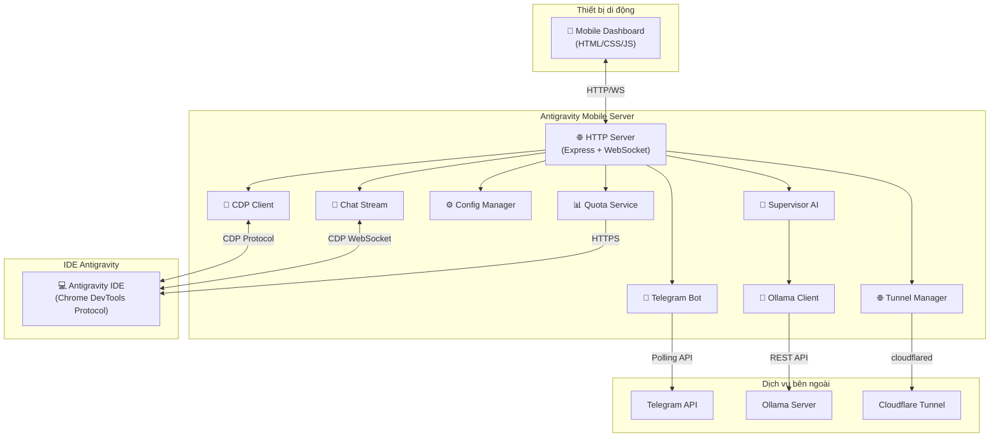
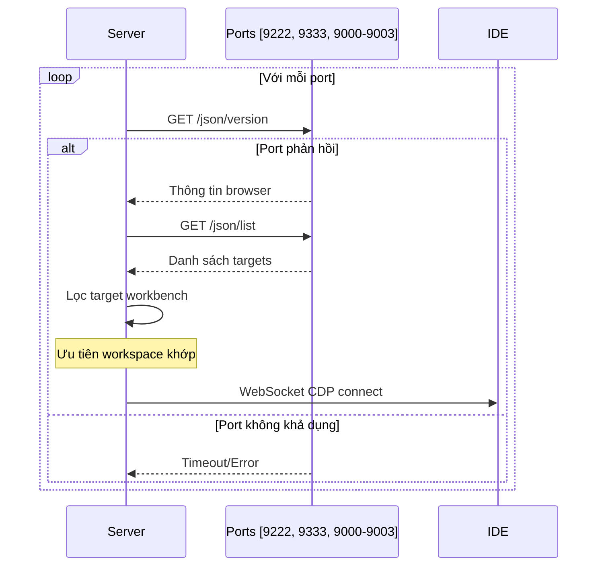
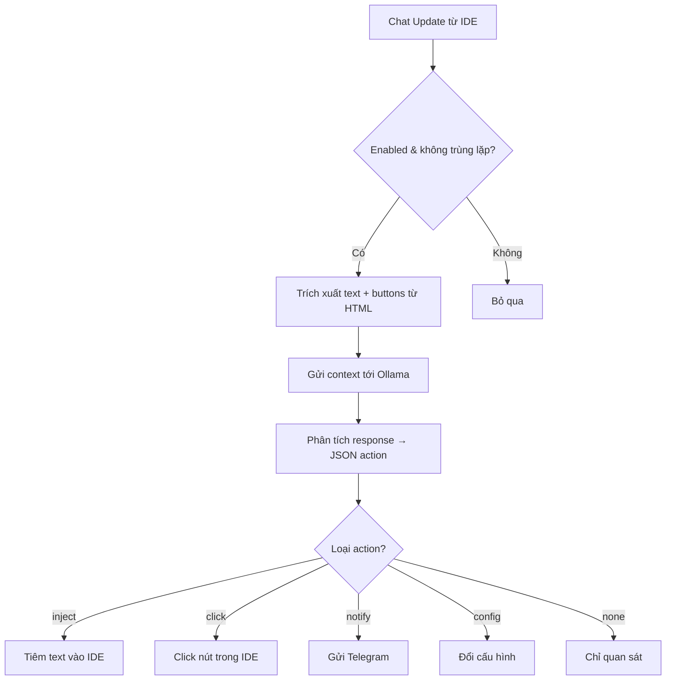
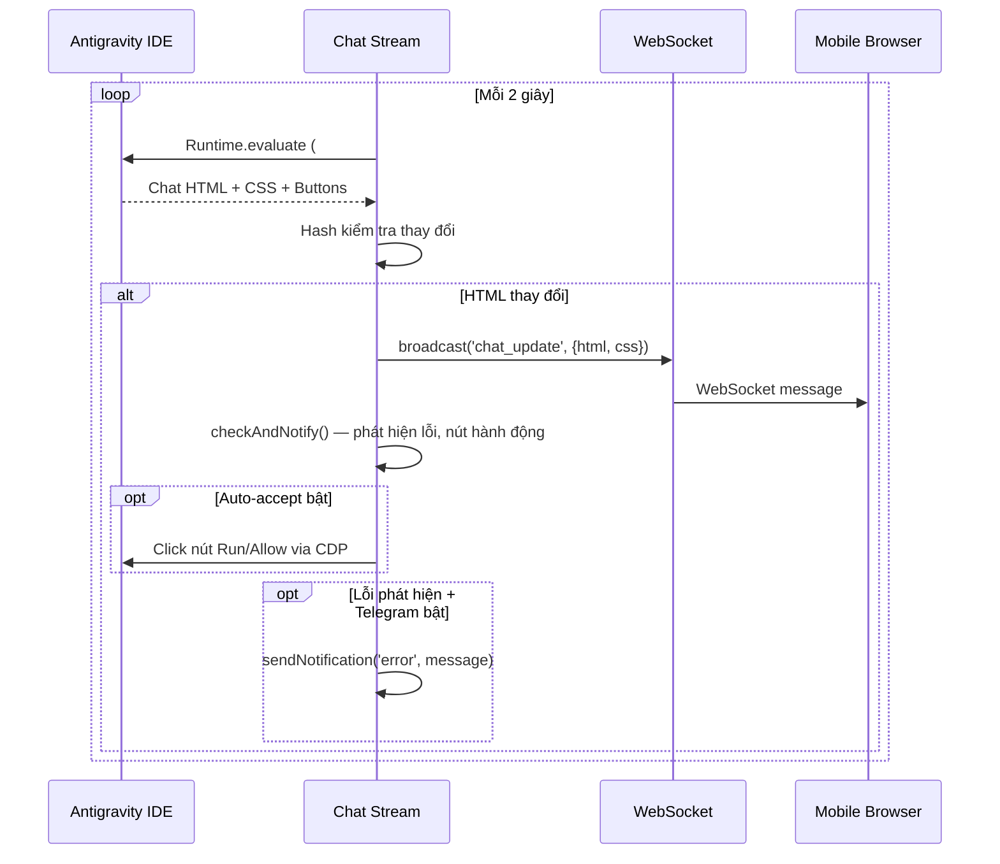
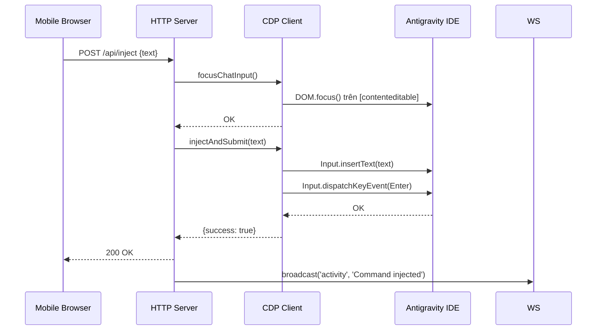
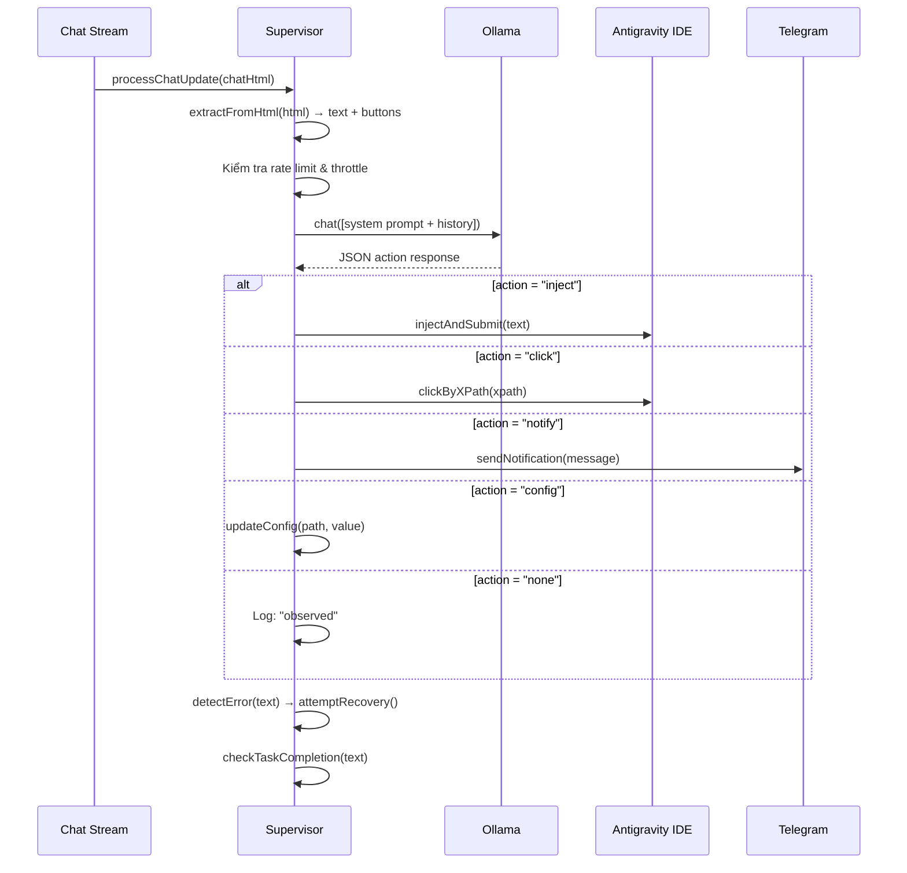

# Tài Liệu Kỹ Thuật — Antigravity Mobile

> **Phiên bản**: 2.0.0  
> **Ngôn ngữ**: Node.js (ES Modules)  
> **Giấy phép**: ISC  
> **Cập nhật lần cuối**: Tháng 3/2026

---

## Mục Lục

1. [Tổng Quan Dự Án](#1-tổng-quan-dự-án)
2. [Kiến Trúc Hệ Thống](#2-kiến-trúc-hệ-thống)
3. [Cài Đặt & Khởi Chạy](#3-cài-đặt--khởi-chạy)
4. [Các Module Chính](#4-các-module-chính)
   - 4.1 [HTTP Server (http-server.mjs)](#41-http-server)
   - 4.2 [CDP Client (cdp-client.mjs)](#42-cdp-client)
   - 4.3 [Chat Stream (chat-stream.mjs)](#43-chat-stream)
   - 4.4 [Config Manager (config.mjs)](#44-config-manager)
   - 4.5 [Quota Service (quota-service.mjs)](#45-quota-service)
   - 4.6 [Supervisor Service (supervisor-service.mjs)](#46-supervisor-service)
   - 4.7 [Telegram Bot (telegram-bot.mjs)](#47-telegram-bot)
   - 4.8 [Tunnel Manager (tunnel.mjs)](#48-tunnel-manager)
   - 4.9 [Launcher (launcher.mjs)](#49-launcher)
   - 4.10 [Ollama Client (ollama-client.mjs)](#410-ollama-client)
5. [Bản Đồ API (API Reference)](#5-bản-đồ-api)
6. [Luồng Dữ Liệu](#6-luồng-dữ-liệu)
7. [Hệ Thống Xác Thực](#7-hệ-thống-xác-thực)
8. [WebSocket — Giao Tiếp Thời Gian Thực](#8-websocket--giao-tiếp-thời-gian-thực)
9. [Hệ Thống Frontend](#9-hệ-thống-frontend)
10. [Bảo Mật](#10-bảo-mật)
11. [Phụ Thuộc (Dependencies)](#11-phụ-thuộc)

---

## 1. Tổng Quan Dự Án

**Antigravity Mobile** là một ứng dụng Node.js hoạt động như **cầu nối di động** (mobile bridge) cho IDE Antigravity. Nó cho phép người dùng **giám sát và điều khiển từ xa** AI coding agent đang chạy trong IDE thông qua điện thoại hoặc bất kỳ thiết bị nào có trình duyệt web.

### Khả năng chính:
- 📱 **Dashboard di động** — Giao diện web responsive để giám sát IDE từ xa
- 💬 **Live Chat Stream** — Sao chép nội dung chat AI agent theo thời gian thực
- 📸 **Chụp màn hình từ xa** — Chụp và xem screenshot IDE liên tục
- ⌨️ **Tiêm lệnh** (Command Injection) — Gửi prompt/lệnh vào IDE từ xa
- 🤖 **Supervisor AI** — AI tự chủ giám sát agent, tự động phục hồi lỗi
- 📂 **Trình quản lý tệp** — Duyệt, đọc, chỉnh sửa file dự án từ xa
- 📱 **Telegram Bot** — Thông báo push khi có lỗi, hoàn thành hoặc cần input
- 🌐 **Tunnel** — Cloudflare tunnel cho truy cập từ xa qua internet
- 📊 **Quota Monitor** — Theo dõi quota sử dụng model AI

---

## 2. Kiến Trúc Hệ Thống



### Mô hình giao tiếp:

| Kết nối                  | Giao thức           | Mô tả                                         |
|--------------------------|---------------------|-------------------------------------------------|
| Mobile ↔ Server          | HTTP + WebSocket    | API REST + WS để cập nhật thời gian thực        |
| Server ↔ IDE             | CDP (WebSocket)     | Chrome DevTools Protocol qua WebSocket          |
| Server ↔ Telegram        | HTTPS (Polling)     | Bot API với long-polling                        |
| Server ↔ Ollama          | HTTP (REST)         | API chat/generate của Ollama                    |
| Server ↔ Cloudflare      | Binary (cloudflared)| Quick Tunnel — child process                    |
| Server ↔ Language Server | HTTPS (gRPC-JSON)   | GetUserStatus API cho quota                     |

---

## 3. Cài Đặt & Khởi Chạy

### Yêu cầu:
- **Node.js** ≥ 18 (cần `fetch` built-in)
- **Antigravity IDE** đang chạy với CDP enabled (`--remote-debugging-port=9222`)
- **Ollama** (tuỳ chọn) nếu sử dụng Supervisor AI
- **cloudflared** (tuỳ chọn) nếu sử dụng tunnel

### Cài đặt:
```bash
git clone https://github.com/AvenalJ/AntigravityMobile.git
cd AntigravityMobile
npm install
```

### Khởi chạy:
```bash
# Khởi chạy chỉ server
npm start          # hoặc: node src/http-server.mjs

# Khởi chạy server + IDE (auto-detect + CDP)
npm run launch     # hoặc: node src/launcher.mjs
```

### Biến môi trường:
| Biến            | Mô tả                                      | Mặc định |
|-----------------|---------------------------------------------|----------|
| `MOBILE_PIN`    | Mã PIN bảo vệ truy cập (4+ ký tự)         | _(không)_ |
| `PORT`          | Cổng HTTP server                            | `3001`   |
| `ANTIGRAVITY_PATH` | Đường dẫn tùy chỉnh đến Antigravity IDE | _(auto)_ |

---

## 4. Các Module Chính

### 4.1 HTTP Server
**File**: `src/http-server.mjs` — **2.168 dòng**

Đây là **trung tâm điều phối** của toàn bộ ứng dụng. Server Express kết hợp WebSocket, quản lý tất cả các API endpoints và phối hợp hoạt động của mọi module khác.

#### Chức năng chính:
- **Express HTTP Server** — Phục vụ dashboard và API REST
- **WebSocket Server** — Phát sóng sự kiện thời gian thực cho tất cả client
- **Middleware** — Xác thực PIN, CORS, JSON parser, file upload (multer)
- **Khởi tạo** — Tự động khởi tạo cấu hình, kết nối CDP, chụp screenshot định kỳ, chat stream, Telegram bot

#### Luồng khởi tạo:
```
1. Đọc config (config.json)
2. Thiết lập Express + middleware
3. Mount tất cả API routes
4. Khởi tạo WebSocket server  
5. Kết nối CDP đến IDE (thử 6 port: 9222, 9333, 9000-9003)
6. Phát hiện workspace path
7. Khởi động screenshot timer (30s mặc định)
8. Bắt đầu chat stream (polling 2s)
9. Khởi tạo Telegram bot (nếu cấu hình)
10. Khởi động tunnel (nếu autoStart = true)
11. Bắt đầu supervisor (nếu enabled)
```

#### API Routes chính (xem chi tiết ở [Mục 5](#5-bản-đồ-api)):
- `/api/status` — Trạng thái hệ thống
- `/api/screenshot` — Chụp màn hình IDE
- `/api/inject` — Tiêm text vào IDE
- `/api/chat-stream/*` — Quản lý live chat
- `/api/files/*` — Duyệt & quản lý file
- `/api/config/*` — Quản lý cấu hình
- `/api/supervisor/*` — Điều khiển Supervisor AI
- `/api/telegram/*` — Điều khiển Telegram bot
- `/api/tunnel/*` — Quản lý tunnel
- `/api/quota` — Xem quota model AI
- `/admin` — Bảng điều khiển quản trị (localhost only)

---

### 4.2 CDP Client
**File**: `src/cdp-client.mjs` — **1.681 dòng**

Module kết nối với Antigravity IDE qua **Chrome DevTools Protocol** (CDP). Đây là cầu nối cốt lõi cho phép điều khiển IDE từ xa.

#### Khả năng:
| Tính năng | Hàm chính | Mô tả |
|-----------|-----------|-------|
| Khám phá port | `discoverCdpPort()` | Quét 6 port CDP để tìm IDE |
| Kết nối | `createCdpConnection()` | Thiết lập WebSocket CDP |
| Chụp ảnh | `captureScreenshot()` | Screenshot toàn bộ IDE (base64) |
| Tiêm lệnh | `injectAndSubmit()` | Gõ text và nhấn Enter trong chat IDE |
| Focus input | `focusChatInput()` | Focus vào ô input chat |
| Lấy chat | `getChatMessages()` | Đọc nội dung chat hiện tại |
| Phát hiện workspace | `detectWorkspacePath()` | Tìm đường dẫn dự án đang mở |
| Click element | `clickElementByXPath()` | Click nút bằng XPath |
| Chọn model | `selectModel()` | Đổi model AI trong IDE |
| Chọn mode | `selectMode()` | Đổi chế độ (Agent/Ask/Manual) |
| Panel content | `getActivePanel()` | Đọc nội dung panel đang mở |

#### Cơ chế khám phá CDP:


#### Multi-workspace support:
CDP Client hỗ trợ nhiều cửa sổ IDE cùng lúc. Khi có `preferredWorkspace`, nó sẽ lọc target theo tiêu đề cửa sổ khớp với workspace name.

---

### 4.3 Chat Stream
**File**: `src/chat-stream.mjs` — **833 dòng**

Module live-streaming nội dung chat của AI agent từ IDE sang thiết bị di động.

#### Cơ chế hoạt động:
1. **Tìm target CDP** — Quét các port và lọc theo workspace
2. **Kết nối CDP** — Mở WebSocket và bật `Runtime.enable`
3. **Tìm #cascade** — Duyệt tất cả execution context để tìm element `#cascade` (container chat)
4. **Capture HTML** — Clone DOM, xử lý terminal canvas (xterm.js), convert ảnh local thành data URL, clean up input bar
5. **Capture CSS** — Thu thập toàn bộ stylesheet + CSS variables
6. **Polling** — Mỗi 2 giây check thay đổi bằng hash, phát sóng nếu có cập nhật

#### Xử lý đặc biệt:
- **Terminal canvas** — xterm.js dùng WebGL nên không thể clone trực tiếp. Module trích xuất text từ accessibility layer hoặc xterm-rows, thay canvas bằng `<pre>` có style
- **Local images** — Ảnh IDE dùng `vscode-file://` scheme không accessible từ mobile. Fetch và convert thành data URL
- **Interactive elements** — Gắn XPath cho mọi button/expandable element để mobile có thể forward click

#### Tự động thông báo:
```
checkAndNotify(html):
├── Phát hiện nút hành động → Gửi "Input Needed" qua Telegram
├── Auto-accept commands → Tự click nút Run/Allow/Accept
├── Agent hoàn thành → Gửi "Complete" qua Telegram
└── checkErrorDialogs() → Quét dialog lỗi trong TẤT CẢ context
```

---

### 4.4 Config Manager
**File**: `src/config.mjs` — **168 dòng**

Quản lý cấu hình tập trung với JSON persistence.

#### Cấu trúc config mặc định:
```javascript
{
    server: { port: 3001, pin: null },
    telegram: { enabled: false, botToken: '', chatId: '', 
                notifications: { onComplete, onError, onInputNeeded } },
    dashboard: { refreshInterval: 2000, theme: 'dark' },
    devices: [{ name: 'Default', cdpPort: 9222, active: true }],
    quickCommands: [/* Run Tests, Git Status, Build */],
    scheduledScreenshots: { enabled: true, intervalMs: 30000 },
    mobileUI: { showQuickActions: true, navigationMode: 'sidebar', theme: 'dark' },
    autoAcceptCommands: false,
    tunnel: { autoStart: false },
    supervisor: {
        enabled: false, provider: 'ollama', endpoint: 'http://localhost:11434',
        model: 'llama3', maxActionsPerMinute: 10,
        errorRecovery: { enabled: true, maxRetries: 3 }
    }
}
```

#### API:
| Hàm | Mô tả |
|-----|-------|
| `loadConfig()` | Đọc config từ `data/config.json`, merge với defaults |
| `saveConfig()` | Ghi config ra file |
| `getConfig(path?)` | Lấy config theo dot-path (VD: `'telegram.botToken'`) |
| `updateConfig(path, value)` | Cập nhật giá trị theo dot-path |
| `mergeConfig(partial)` | Deep merge partial config |

---

### 4.5 Quota Service
**File**: `src/quota-service.mjs` — **396 dòng**

Theo dõi quota sử dụng model AI bằng cách kết nối trực tiếp đến Language Server của Antigravity.

#### Cơ chế:
1. **Quét process** — Tìm process `language_server` có `--csrf_token` qua PowerShell
2. **Trích xuất thông tin** — Lấy CSRF token và port từ command line arguments
3. **Gọi API** — `POST /exa.language_server_pb.LanguageServerService/GetUserStatus`
4. **Phân tích** — Parse `clientModelConfigs` → tỷ lệ còn lại, thời gian reset, trạng thái

#### Trạng thái quota:
| Trạng thái | Ngưỡng | Ý nghĩa |
|------------|--------|---------|
| `healthy` | > 30% | Bình thường |
| `warning` | 10-30% | Cảnh báo |
| `danger` | 1-10% | Nguy hiểm |
| `exhausted` | 0% | Hết quota |

#### Caching:
- **Quota data**: cache 15 giây
- **Connection info**: cache 1 phút

> ⚠️ **Lưu ý**: Module này sử dụng PowerShell commands, chỉ hoạt động trên **Windows**. Trên macOS/Linux cần điều chỉnh hàm `findLanguageServer()`.

---

### 4.6 Supervisor Service
**File**: `src/supervisor-service.mjs` — **1.211 dòng**

**AI giám sát tự chủ** — Module phức tạp nhất, sử dụng Ollama (LLM local) để giám sát và can thiệp vào AI agent.

#### 6 tính năng chính:

##### Feature 1: Vòng lặp quyết định chính


##### Feature 2: Phục hồi lỗi tự động
- Phát hiện 10 loại lỗi: TypeScript, Runtime, Test, Build, Module, Filesystem, Critical, Command, Timeout, Stuck
- Gọi Ollama để phân tích và đề xuất fix
- Rate limit: max 3 lần retry mỗi lỗi, cooldown 30 giây
- Inject fix tự động vào IDE

##### Feature 3: Task Queue
- Hàng đợi tác vụ với trạng thái: `pending` → `running` → `completed`
- Tự động bắt đầu task tiếp theo khi task hiện tại hoàn thành
- Ollama kiểm tra task completion dựa trên chat output

##### Feature 4: File Awareness
- Đọc file dự án qua `[READ:path]` syntax
- Liệt kê thư mục qua `[LIST:path]` syntax
- Pre-read: tự phát hiện file mentions trong câu hỏi và đọc trước

##### Feature 5: Session Intelligence
- Lưu session digest (`data/supervisor-sessions.json`)
- Thống kê: messages processed, actions executed, errors detected/fixed
- Smart history: summarize lịch sử cũ bằng Ollama khi quá dài (>15 messages)

##### Feature 6: Suggest Mode
- Thay vì tự thực thi, queue hành động để người dùng duyệt
- API approve/dismiss cho từng suggestion
- Thông báo qua Telegram + WebSocket

#### Rate Limiting:
- Max 10 actions/phút (configurable)
- Min 3 giây giữa các lần xử lý
- Sliding window cho action counting

---

### 4.7 Telegram Bot
**File**: `src/telegram-bot.mjs` — **457 dòng**

Bot Telegram hỗ trợ thông báo push và điều khiển từ xa.

#### Commands:
| Lệnh | Mô tả |
|-------|-------|
| `/start` | Chào mừng + hiển thị Chat ID |
| `/help` | Danh sách lệnh |
| `/status` | Trạng thái CDP, uptime, số client |
| `/quota` | Quota model AI (thanh tiến trình) |
| `/screenshot` | Chụp IDE, gửi ảnh |

#### Loại thông báo:
| Type | Icon | Khi nào |
|------|------|---------|
| `complete` | ✅ | Agent hoàn thành tác vụ |
| `error` | ❌ | Lỗi nghiêm trọng (quota, crash) |
| `input_needed` | 🔔 | Cần user input (kèm inline buttons) |
| `progress` | ⏳ | Tiến trình |
| `warning` | ⚠️ | Cảnh báo |

#### Tính năng nâng cao:
- **Rate limiting** — Max 15 lệnh/phút/user, cảnh báo khi vượt
- **Message threading** — Nhóm thông báo liên quan thành reply chain (expire sau 1 giờ)
- **Inline keyboard** — Nút bấm trực tiếp trong Telegram để chấp nhận/từ chối lệnh
- **Lazy-load dependency** — Chỉ import `node-telegram-bot-api` khi cần, không crash nếu chưa install

---

### 4.8 Tunnel Manager
**File**: `src/tunnel.mjs` — **151 dòng**

Quản lý Cloudflare Quick Tunnel để truy cập ứng dụng từ internet.

#### Cách hoạt động:
1. Spawn process `cloudflared tunnel --url http://localhost:{port}`
2. Parse stdout/stderr để tìm URL `https://{random}.trycloudflare.com`
3. Timeout 30 giây nếu không có URL

#### API:
```javascript
startTunnel(port, timeoutMs?)  // → { success, url? }
stopTunnel()                    // → { success }
getTunnelStatus()               // → { running, starting, url, error }
```

#### Cross-platform:
- **Windows**: Dùng `taskkill /F /T /PID` để kill process tree
- **Unix**: Dùng `SIGTERM`

> 💡 Không cần tài khoản Cloudflare — sử dụng Quick Tunnel (URL ngẫu nhiên)

---

### 4.9 Launcher
**File**: `src/launcher.mjs` — **389 dòng**

Script khởi chạy one-click: tự động start server, tìm IDE, và launch với CDP.

#### Quy trình:
```
1. Start HTTP Server (detached process)
2. Tìm Antigravity IDE:
   ├── Windows: LOCALAPPDATA, PROGRAMFILES
   ├── macOS: /Applications, ~/Applications
   └── Linux: /usr/bin, /usr/local/bin, /opt
3. Kiểm tra CDP port 9222:
   ├── Đang chạy → Dùng luôn
   └── Không chạy → Kill IDE cũ + Relaunch với --remote-debugging-port=9222
4. Chờ CDP ready (15 giây timeout)
5. Hiển thị IP + URL dashboard
6. Tự mở Admin Panel trong browser
```

#### Phát hiện IP thông minh:
- Ưu tiên Wi-Fi/Ethernet thật (không phải VMware/Docker/WSL)
- Lọc địa chỉ 192.168.x.x (bỏ .1 gateway)
- Fallback: bất kỳ IPv4 non-internal

---

### 4.10 Ollama Client
**File**: `src/ollama-client.mjs` — **195 dòng**

Wrapper nhẹ cho Ollama REST API. **Không phụ thuộc npm** — chỉ sử dụng `fetch` built-in.

#### API:
| Hàm | Mô tả | Timeout |
|-----|-------|---------|
| `isAvailable()` | Kiểm tra Ollama có sẵn | 5s |
| `listModels()` | Liệt kê model | 5s |
| `chat(messages, model)` | Chat (sync) | 2 phút |
| `chatStream(messages, model, onToken)` | Chat (streaming) | 5 phút |
| `generate(prompt, model)` | Generate text (non-chat) | 2 phút |

#### Streaming:
- Đọc response body bằng `ReadableStream.getReader()`
- Buffer dòng không hoàn chỉnh
- Parse từng dòng JSON, gọi `onToken(text)` cho mỗi token

---

## 5. Bản Đồ API

### Endpoints công khai (yêu cầu PIN nếu có):

#### Hệ thống & Trạng thái
| Method | Path | Mô tả |
|--------|------|-------|
| GET | `/api/status` | Trạng thái server, CDP, WS, workspace |
| GET | `/api/quota` | Quota model AI |
| GET | `/api/health` | Health check |

#### Chụp màn hình & Điều khiển IDE
| Method | Path | Mô tả |
|--------|------|-------|
| GET | `/api/screenshot` | Chụp screenshot IDE (base64 PNG) |
| GET | `/api/screenshots/gallery` | Danh sách screenshot đã lưu |
| POST | `/api/inject` | Tiêm text vào IDE chat |
| POST | `/api/click` | Click element bằng XPath |
| POST | `/api/focus-input` | Focus ô input chat |

#### Chat Stream
| Method | Path | Mô tả |
|--------|------|-------|
| POST | `/api/chat-stream/start` | Bắt đầu chat stream |
| POST | `/api/chat-stream/stop` | Dừng chat stream |
| GET | `/api/chat-stream/status` | Trạng thái stream |
| GET | `/api/chat-stream/snapshot` | Snapshot chat hiện tại |

#### Quản lý tệp
| Method | Path | Mô tả |
|--------|------|-------|
| GET | `/api/files/browse?path=...` | Duyệt thư mục |
| GET | `/api/files/read?path=...` | Đọc nội dung file |
| POST | `/api/files/save` | Lưu file |
| POST | `/api/upload` | Upload file |

#### Cấu hình & Thiết bị
| Method | Path | Mô tả |
|--------|------|-------|
| GET | `/api/config` | Lấy toàn bộ config |
| POST | `/api/config` | Cập nhật config |
| GET | `/api/devices` | Danh sách thiết bị CDP |
| POST | `/api/devices` | Cập nhật thiết bị |

#### Supervisor AI
| Method | Path | Mô tả |
|--------|------|-------|
| GET | `/api/supervisor/status` | Trạng thái supervisor |
| POST | `/api/supervisor/start` | Bật supervisor |
| POST | `/api/supervisor/stop` | Tắt supervisor |
| GET | `/api/supervisor/log` | Nhật ký hành động |
| POST | `/api/supervisor/chat` | Chat với supervisor (Assist tab) |
| POST | `/api/supervisor/chat/stream` | Chat streaming (SSE) |
| GET | `/api/supervisor/tasks` | Xem task queue |
| POST | `/api/supervisor/tasks` | Thêm task |
| POST | `/api/supervisor/suggest/:id/approve` | Duyệt suggestion |
| POST | `/api/supervisor/suggest/:id/dismiss` | Từ chối suggestion |

#### Telegram & Tunnel
| Method | Path | Mô tả |
|--------|------|-------|
| POST | `/api/telegram/start` | Khởi động bot |
| POST | `/api/telegram/stop` | Dừng bot |
| POST | `/api/telegram/test` | Gửi tin nhắn test |
| POST | `/api/tunnel/start` | Mở tunnel |
| POST | `/api/tunnel/stop` | Đóng tunnel |
| GET | `/api/tunnel/status` | Trạng thái tunnel |

#### Xác thực
| Method | Path | Mô tả |
|--------|------|-------|
| POST | `/api/auth/verify` | Xác thực PIN |
| GET | `/api/auth/status` | Kiểm tra trạng thái auth |

### Admin Panel (localhost only):
| Path | Mô tả |
|------|-------|
| `/admin` | Bảng điều khiển quản trị toàn diện |

---

## 6. Luồng Dữ Liệu

### Luồng 1: Chat Stream (IDE → Mobile)



### Luồng 2: Command Injection (Mobile → IDE)



### Luồng 3: Supervisor AI Decision Loop



---

## 7. Hệ Thống Xác Thực

### Mô hình xác thực PIN:

```
Trường hợp 1: Không có PIN (mặc định)
  → Tất cả request được phép, không cần auth

Trường hợp 2: Có PIN (MOBILE_PIN hoặc server.pin)
  → Client gửi POST /api/auth/verify {pin}
  → Server tạo SHA-256 hash, so sánh
  → Nếu đúng: set cookie session (http-only)
  → Các request tiếp theo kiểm tra cookie

Middleware: checkAuth(req, res, next)
  → Skip cho: /api/auth, /api/health, static files
  → Kiểm tra pin-session cookie
  → 401 nếu không hợp lệ
```

### Admin Panel — Bảo vệ bổ sung:
Admin panel chỉ accessible từ `localhost` hoặc `127.0.0.1`. Mọi request từ IP khác bị chặn với 403.

---

## 8. WebSocket — Giao Tiếp Thời Gian Thực

### Events được phát sóng:

| Event | Data | Nguồn |
|-------|------|-------|
| `chat_update` | `{html, css, bodyBg}` | Chat Stream |
| `screenshot` | `{data: base64}` | Scheduled screenshot |
| `activity` | `{type, message, timestamp}` | Mọi hoạt động hệ thống |
| `supervisor_action` | `{action, detail, result}` | Supervisor AI |
| `supervisor_status` | `{status: idle/thinking/acting}` | Supervisor AI |
| `supervisor_suggestion` | `{id, action, reason}` | Suggest Mode |
| `tunnel_status` | `{running, url}` | Tunnel Manager |
| `error` | `{message}` | Lỗi hệ thống |

### Connection lifecycle:
```javascript
// Client
const ws = new WebSocket('ws://host:3001');
ws.onmessage = (event) => {
    const { type, data, timestamp } = JSON.parse(event.data);
    // Handle event
};

// Server broadcast
function broadcast(type, data) {
    const message = JSON.stringify({ type, data, timestamp });
    wss.clients.forEach(client => {
        if (client.readyState === WebSocket.OPEN) {
            client.send(message);
        }
    });
}
```

---

## 9. Hệ Thống Frontend

### Cấu trúc:
```
public/
├── index.html          # Dashboard di động chính (26KB)
├── admin.html          # Admin panel toàn diện (142KB) 
├── minimal.html        # Giao diện tối giản (34KB)
├── manifest.json       # PWA manifest
├── sw.js               # Service Worker
├── css/                # Stylesheets
├── js/                 # JavaScript modules
├── icon-192.png        # App icon 192px
├── icon-512.png        # App icon 512px
└── apple-touch-icon.png # iOS home screen icon
```

### Dashboard di động (`index.html`):
- **Tab Chat** — Live chat stream từ IDE, hỗ trợ click buttons
- **Tab Files** — Trình duyệt file, xem/chỉnh sửa
- **Tab Settings** — Trạng thái CDP, model selector, quick commands, quota
- **Tab Assist** — Chat trực tiếp với Supervisor AI

### Admin Panel (`admin.html`):
Giao diện quản trị toàn diện, chỉ truy cập từ localhost:
- Dashboard tổng quan
- Quản lý thiết bị CDP
- Tùy chỉnh giao diện (5 themes)
- Cấu hình Telegram bot
- Quản lý tunnel
- Nhật ký & phân tích
- Gallery screenshot
- Cấu hình Supervisor AI

### PWA Support:
- Service Worker với caching strategy
- Manifest cho "Add to Home Screen"
- Icons cho iOS và Android

---

## 10. Bảo Mật

### Các biện pháp bảo mật:

| Lớp | Biện pháp | Mô tả |
|-----|-----------|-------|
| **Xác thực** | PIN hash (SHA-256) | Mã PIN 4+ ký tự, lưu hash |
| **Session** | HTTP-only cookie | Cookie session không truy cập từ JS |
| **Admin** | localhost-only | Admin panel chỉ từ 127.0.0.1 |
| **File access** | Path sanitization | Chặn truy cập ngoài workspace |
| **File upload** | Size limit | Giới hạn kích thước upload (multer) |
| **Rate limit** | Per-user window | Telegram: 15 cmd/phút; Supervisor: 10 action/phút |
| **CDP** | Port discovery | Chỉ kết nối CDP local (127.0.0.1) |
| **Telegram** | Chat ID check | Chỉ phản hồi chat ID đã authorize |

### Rủi ro cần lưu ý:
- ⚠️ Khi bật tunnel, dashboard có thể truy cập từ internet — **BẮT BUỘC đặt PIN**
- ⚠️ Auto-accept commands tự động click Run/Allow — chỉ bật khi tin tưởng agent
- ⚠️ Supervisor inject có thể thực thi lệnh trong IDE — cấu hình `suggestMode` cho an toàn

---

## 11. Phụ Thuộc

### Dependencies chính:
| Package | Phiên bản | Mục đích |
|---------|-----------|----------|
| `express` | ^5.1.0 | HTTP framework |
| `ws` | ^8.18.2 | WebSocket server |
| `multer` | ^2.0.1 | File upload middleware |
| `sql.js` | ^1.12.0 | SQLite (cho activity log) |
| `node-telegram-bot-api` | ^0.66.0 | Telegram Bot API |

### Không cần dependency cho:
- **Ollama client** — Dùng `fetch` built-in (Node.js 18+)
- **CDP client** — Dùng `ws` package (đã có) + `fetch`
- **Tunnel** — Dùng `child_process.spawn` + `cloudflared` binary
- **Config** — Dùng `fs` built-in
- **Quota** — Dùng `https` + `child_process` built-in

### Scripts:
```json
{
    "start": "node src/http-server.mjs",
    "launch": "node src/launcher.mjs"
}
```

---

> 📝 **Tài liệu này được tạo từ phân tích mã nguồn trực tiếp** — 10 module, ~7.000+ dòng code.
> Cập nhật khi có thay đổi kiến trúc hoặc API mới.
